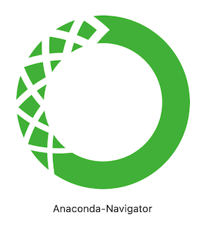

<html>
    <head>
        <meta charset="utf-8">
        <title>sai sumanth </title>
        <link rel="stylesheet" href="style.css">
        <link rel="icon" href="favicon.ico">
        <link rel="preconnect" href="https://fonts.gstatic.com">
        <link href="https://fonts.googleapis.com/css2?family=Sacramento&display=swap" rel="stylesheet">

    </head>
    <body>
      <ul>
        <li><a  href="index.html">Home</a></li>
        <li><a  href="certificates.html">Online Courses</a></li>
        <li><a  href="workshop.html">Workshops</a></li>
        <li><a  href="projects.html">Projects</a></li>
        <li><a  href="about.html">About Me</a></li>
      </ul>
        

            <h1> <em>I'm Sai Sumanth </em> </h1>
            <h2>A Programmer Interested in data science, mobile applications, web development and machine learning technologies</h2> 
        

        

            

              
              <h2>Hello.</h2>
              
I'm Self-motivated and hardworking graduate seeking an opportunity to work in the challenging environment to prove my coding skills and utilize my knowledge of various data science, mobile application development, image processing, computer vision and machine learning techniques for the growth of the organizations.

            

            

            

              <h2>My Skills.</h2>
              

                
                <h3>Design and Develpment</h3>
                
I started my code when I was 17 years old because I wanted to make my own apps, games. I have gained a wealth of experience design and developing mobile and web applications

              

              

              

              

                <h2>Tools</h2>
              

                
                <h3>Android Studio</h3>
                
I'm very much familiar with Android Studio.I done a lot of android applications using this tool.

              

              

                
                <h3>Xcode</h3>
                
I'm familiar with Xcode. Present I'm working on IOS applications

              

              

                
                <h3>Visual Studio</h3>
                
I'm very much familiar with visualstudio.I done a lot of web applications using this tool.

              

              

                
                <h3>Matlab</h3>
                
I'm familiar with Matlab.Present I'm working on image processing using Matlab.

              

              

                
                <h3>Anaconda Navigator</h3>
                
I'm very much familiar with anaconda navigator.using jupyter notebook i work on python programs.

              

              

                
                <h3>Eclipse</h3>
                
I'm very much familiar with Eclipse.using this tool i done a lot of servlets and jsp programs.

              

              

            
              

              

                <h2>Programming Languages</h2>
                
C 
 
                
CORE JAVA
 
                
ADVANCE JAVA
 
                
PYTHON
 
                
JAVA SCRIPT
 
                
NODE JS
 
                
PHP
 
                
SWIFT
 

              

              

            

              <h2>Get In Touch</h2>
              <a class="btn" href="mailto:saisumanthkuni@gmail.com">CONTACT ME</a>
            

            

          

          
          
          

            <a class="footer-link" href="https://github.com/sai-sumanth">GitHub</a>
            <a class="footer-link" href="https://www.linkedin.com/in/kuni-sai-sumanth-581816193/">LinkedIn</a>
            
© 2021 SAI SUMANTH KUNI.

          

          

    </body>
    
</html>
